# Vorstellung

- Julius Aka, 28 Jahre alt
- Doktorand am Lehrstuhl für Mechatronk der Universität Augsburg
- Thema: Energiesystemsimulation und Scientific Machine Learning ("KI")
- Master in Energietechnik (Maschinenbau), TU Hamburg
  - Auslandsjahr an UC Berkeley, Kalifornien
- Bachelor in Allgemeine Ingenieurwissenschaften, TU Hamburg
  - Vertiefung Energie- und Umwelttechnik

- Tätigkeiten bei XRG-Simulation, Siemens Gamesa, Institut für technische Thermodynamik
- Deutschlandstipendien 2017-2022, VDI-Preis Hamburg, (BA & MA), bidt graduate center Stipendiant

# Einführung

## Die Klimakatastrophe

:::{.column width="50%"}
- wesentliche Treibhausgase:
  - $\text{CO}_2$
  - Methan, ca. 80x klimaschädlicher als $\text{CO}_2$ über 20 Jahre
  - weitere: Lachgas, F-Gase, ...
- Emissionsbudget
- Wesentlich mehr fossiler Brennstoffe, als die Erde verkraften kann
:::   

:::{.column width="50%"}

<iframe src="https://www.pik-potsdam.de/Carbonclock/Carbonclock.htm" style="width:600px; height:340px;"></iframe>
(Quelle: [Potsdam-Institut für Klimafolgenforschung](https://www.pik-potsdam.de/de/institut/abteilungen/klimaoekonomie-und-politik/verbleibendes-co2-budget/so-schnell-tickt-die-co2-uhr))

:::

## Emissionen weltweit

:::{.column width="50%"}
- Peak ist noch nicht erreicht
<iframe src="https://ourworldindata.org/explorers/co2?time=1950..2024&hideControls=true&Gas+or+Warming=CO%E2%82%82&Accounting=Territorial&Fuel+or+Land+Use+Change=Fossil+%2B+land+use+change&Count=Per+country&country=CHN~USA~IND~OWID_WRL~European+Union+%2828%29&tab=line" loading="lazy" style="width: 100%; height: 600px; border: 0px none;" allow="web-share; clipboard-write"></iframe>
@owid-co2-and-greenhouse-gas-emissions

:::

:::{.column width="50%"}
- China: Erfolg der EE im Stromsektor
<iframe src="https://ourworldindata.org/grapher/share-electricity-low-carbon?tab=line&country=OWID_WRL~OWID_EU27~USA~CHN~DEU" loading="lazy" style="width: 100%; height: 600px; border: 0px none;" allow="web-share; clipboard-write"></iframe>
@ritchie2023-data-page-low-carbon-electricity

:::

## aktueller Stand der Zielerreichung

:::{.column width="50%"}

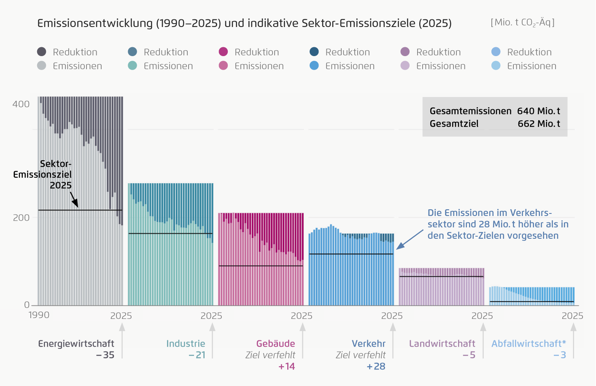

:::

:::{.column width="50%"}

- Energiewirtschaft (Stromerzeugung) auf Kurs
- Industrie: Effizienzgewinne und Verlagerung ins Ausland (Bezugsjahr 1990)
- Verkehr & Gebäude: großer Nachholbedarf
- Climate Action Tracker: 
  - [Deutschland](https://climateactiontracker.org/countries/germany/) "Insufficient", derzeitige Maßnahmen reichen **fast** für <+2°C aus @climate_action_tracker_germany_2026
  - [Weltweite Maßnahmen](https://climateactiontracker.org/global/cat-thermometer/): +2.6°C, aktuelle Ziele: +2.2°C @climate_action_tracker_cat_thermometer_2025

:::

# Energiequellen der Zukunft

## "Primärenergie" der Zukunft
- Photovoltaik und Wind $\rightarrow$ Strom: "All Electric Society"
- eher nicht: 
  - ~~Wasserstoff~~ (["Champagner der Energiewende"](https://live.handelsblatt.com/wasserstoff-champagner-der-energiewende/))
  - aber Wasserstoff als saisonaler Energiespeicher und Grundstoff für Chemie und Schwerindustrie
- ganz sicher nicht:
  - ~~Kernenergie~~ (Energiewende jetzt nötig, nicht in 20 Jahren, Bauzeiten)
  - ~~Kernfusion~~ (aus selbem Grund)
 
## Boom von Wind & Solar weltweit

:::{.column width="50%"}

<iframe src="https://ourworldindata.org/grapher/modern-renewable-prod?tab=line" loading="lazy" style="width: 100%; height: 600px; border: 0px none;" allow="web-share; clipboard-write"></iframe>

@owid-renewable-energy

:::

:::{.column width="50%"}

- Boom von Solar und Wind weltweit
- Wasserkraftspotenziale in Deutschland ausgeschöpft
  - Vorteile:
    - Regelbarkeit
    - in begrenzten Umfang Speicherfähigkeit

:::

## Solar & Wind sind am günstigsten

:::{.column width="50%"}

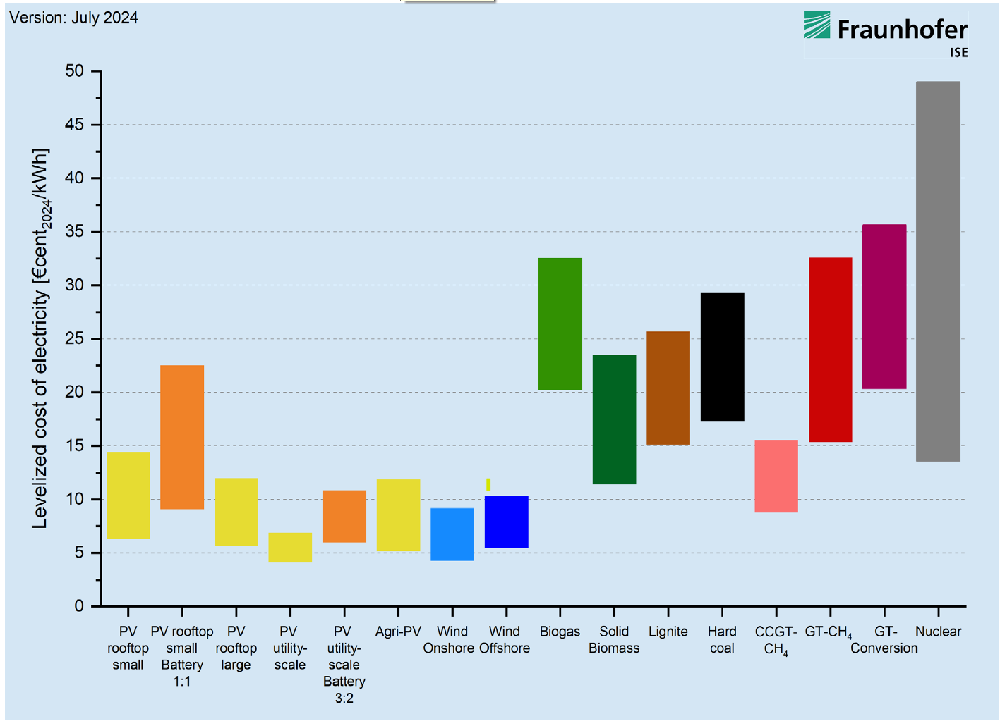

:::

:::{.column width="50%"}

- Solar und Wind sind in Deutschland am günstigsten
- Biogas nach Nuklearenergie teuerste Form der Stromerzeugung
  - Folgen für Biodiversität & Konkurrenz mit weltweiter Nahrungsmittelproduktion
- meine Meinung: 
  - besser PV (32x mehr Strom) bzw. Wind (850x mehr) @thuenen_energie_vom_acker_2023
  - ggf. in Kombination mit Wasserstoffproduktion

:::

---

 in Deutschland 2024 @energy_charts_deutschland](assets/ee_stromerzeugung_2024.svg)

- Wind & Solarenergie ergänzen sich im Jahresverlauf
- jedoch: Wind deutlich volatiler, Feb. 2025 z.B. 9GWh anstatt 16GWh 2024

<!-- Ich gehe im folgenden nicht auf Preise (ausreichend gering) und Emissionen (ausreichend gering) ein -->

## Wind

:::{.column width="50%"}

 stark abhängig von Wetter @energy_charts_deutschland](assets/wind_woche.svg)

:::

:::{.column width="50%"}

 pro Tag im bisherigen 2026 @energy_charts_deutschland](assets/wind_anfang_2026.svg)

:::

- $\rightarrow$ Starkwindphasen über mehrere Tage senken den Börsen-Strompreis deutlich
- $\rightarrow$ Flauten erhöhen den Strompreis deutlich (v.a. im Winter)

## Sonne

:::{.column width="50%"}

 mit Peak am Mittag @energy_charts_deutschland](assets/solar_woche.svg)

:::

:::{.column width="50%"}

 pro Tag im bisherigen 2026 @energy_charts_deutschland](assets/solar_anfang_2026.svg)

:::

- $\rightarrow$ täglicher Peak der PV Erzeugung
- $\rightarrow$ im Sommer regelmäßig mittags geringste Börsen-Strompreise

## Bioenergie

 & fossile Kraftwerke vs. Börsenstrompreis: fixe EEG-Vergütung verhindert Flexibilisierung @energy_charts_deutschland](assets/biogas_mangelnde_flexibilisierung.svg)

- ungenutztes Potenzial: keine Flexibilisierung durch fehlende Anreize bei Bestandsanlagen (EEG-Vergütung zeitlich konstant)
- hohe Umrüstungskosten (zusätzliche BHKW und Gasspeicher)

# Wärmepumpen und Elektromobilität
"Das beste was der Effizienz je passiert ist"

Puzzlestück 1: Energieverbrauch verringern

## Elektromobilität

:::{.column width="50%"}

- fossile Mobilität: 20-40% Wirkungsgrad
- elektrische Mobilität: 80-90% Wirkungsgrad
  - $\rightarrow$ Faktor 3 effizienter
  - Emissionsabnahme über Lebenszyklus durch fortschreitende Dekarbonisierung der Stromerzeugung

:::

:::{.column width="50%"}
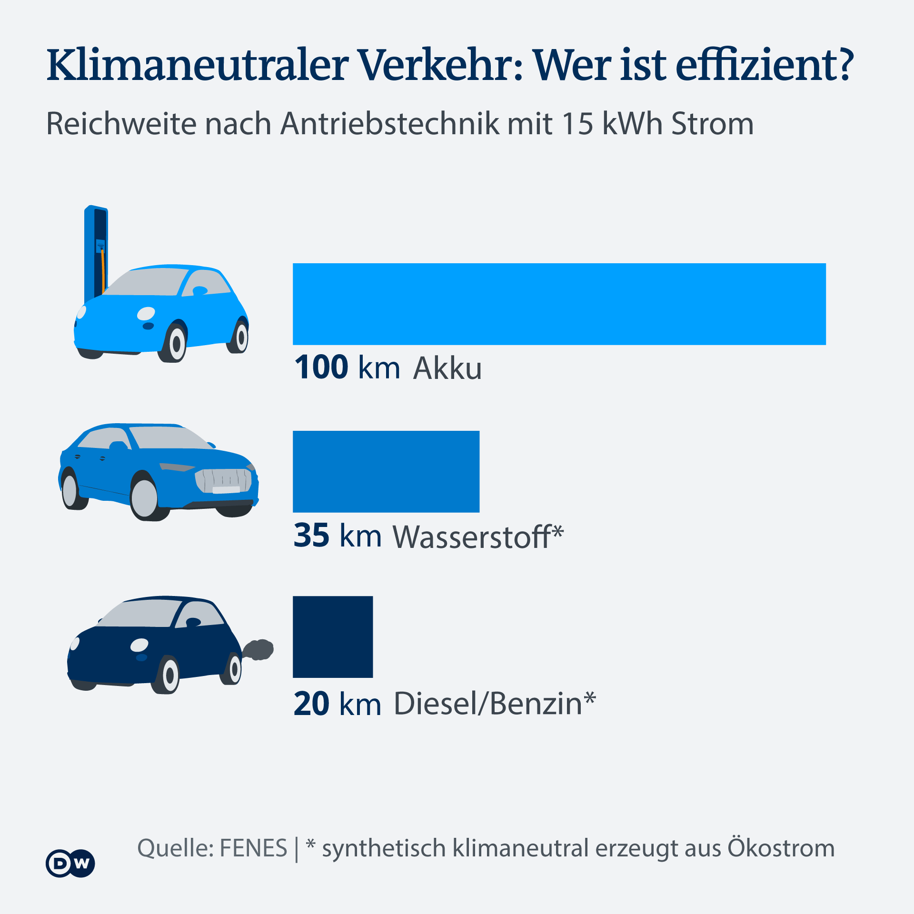
:::

## Wärmepumpen

:::{.column width="50%"}
- fossile Heizung: 80-90% Wirkungsgrad
- Wärmepumpe: 300-700% Wirkungsgrad (COP 3-7)
  - Wirkungsgraddefinition $\text{COP} = \frac{\text{Nutzen}}{\text{Aufwand}}$, Umweltwärme kostenlos, nur Strom als Aufwand
  - $\rightarrow$ Faktor 4-8 effizienter als Heizung
  - Emissionsabnahme über Lebenszyklus durch fortschreitende Dekarbonisierung der Stromerzeugung
- mit E-Fuels heizen ist "politische Nebelkerze"
:::

:::{.column width="50%"}

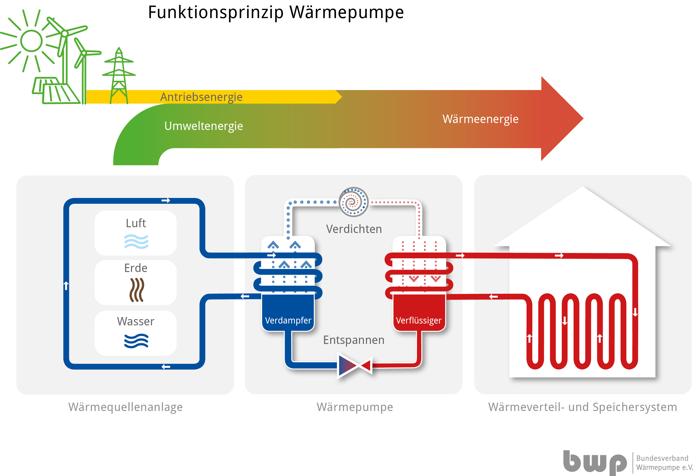

:::

## Bedeutung für die Energiewende 1

:::{.column width="50%"}

- Energieerhaltung
  - $\sum E_{in} = \sum E_{out}$
- Energieflussdiagramm:
  - Primärenergie: Energie vor erster Umwandlung
  - Nutzenergie: Energie, die Aufgaben erfüllt (z.B. Heizen, Fahren)

:::

:::{.column width="50%"}

 @bdew_nutzenergiebilanz_2025](assets/2_Energieflussbild_Deutschland_2023_TWh_vereinfacht.svg)

- 46% Verlust von Primär- zu Nutzenergie in Deutschland:
  - Verkehr, Kraftwerke, (Gebäudeheizung)
- "Erneuerbare Energien erreichen 19% am Primärenergiebedarf" @bdew_nutzenergiebilanz_2025

:::

## Bedeutung für die Energiewende 2

:::{.column width="50%"}

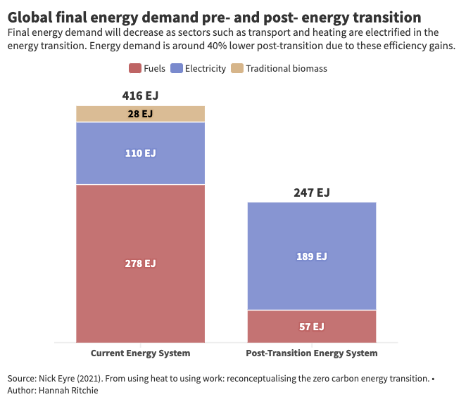{width="67%"}

:::

:::{.column width="50%"}

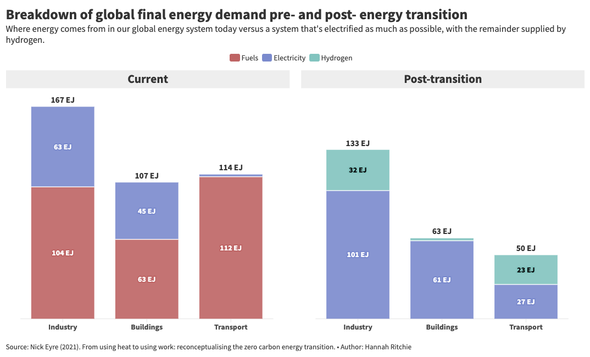

:::

- Wärmepumpen und Elektromobilität $\rightarrow$ Halbierung des Endenergiebedarfs in Gebäuden und Mobilität, -40% Endenergiebedarf weltweit
- Endenergiebedarf: Energie die von Verbraucher bezogen werden muss
- "primary energy fallacy" @rosenow_primary_energy_fallacy_2024: Das Problem wird kleiner, je mehr wir uns ihm nähern

# Sektorenkopplung und Speicher

Puzzlestück 2: Das was geht, an Erzeugung anpassen

Puzzlestück 3: Energie kurz- und langfristig speichern

## Speicher (kurzfristig): Batterien 

Wirkungsgrad: 95%

:::{.column width="50%"}

<iframe src="https://ourworldindata.org/grapher/price-of-lithium-ion-battery-cells?time=2004..latest&tab=line" loading="lazy" style="width: 80%; height: 600px; border: 0px none;" allow="web-share; clipboard-write"></iframe>
@owid-battery-price-decline

:::

:::{.column width="50%"}

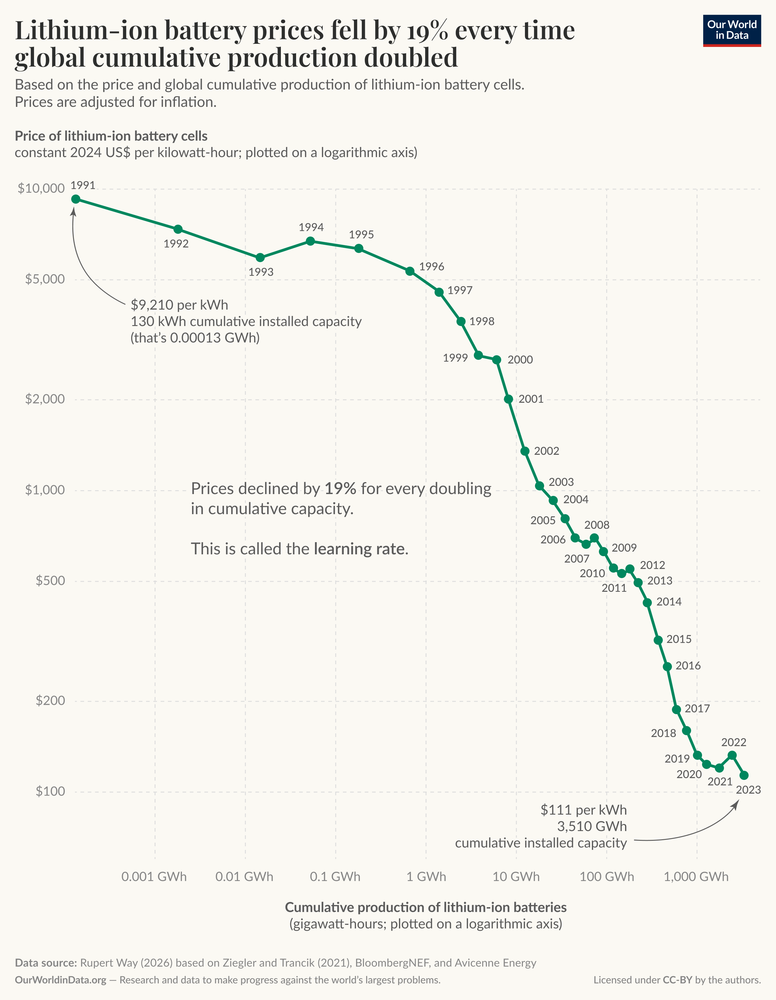{width="70%"}

:::

## Was ist Power-to-X / Sektorenkopplung?
- Verknüpfung von verschiedenen Energieträgern
- Strom, Wärme und Rohstoffindustrie nicht mehr getrennte Systeme, sondern gekoppelt
- Dreh- und Angelpunkt: Stromnetz

## Power-to-Mobility
- Zeitpunkt der Ladung von E-Autos, E-LKWs, E-Busse verschieben
- meist geringe Komforteinbußen
- "~~Marginalerzeugungsansatz~~" (in einigen Studien)
- großes Potenzial für bidirektionales Laden: 
  - im Jahr 2030 könnte Deutschlands Strombedarf 18h lang komplett durch E-Auto Batterien gedeckt werden^[eigene Hochrechnung basierend auf @fraunhofer_iao_bidirektionales_laden_2025 1000Gwh, zu 90% nicht genutzt, durchschnittlich 50GW Last]

## Power-to-Heat

- Wärmepumpen privat
- Großwärmepumpen (Fernwärme)
- Power-to-heat mittels Elektrodenheizung (Fernwärme)
  - geringer Wirkungsgrad, aber auch geringe Investition $\rightarrow$ negative Strompreise, Engpassmanagement
- Hochtemperaturspeicher zum Puffern

## Speicher (langfristige): Power-to-Gas

- Wasserstoff-Herstellung
  - Energie-Speicher und Industrie-Rohstoff (chemische & Schwerindustrie)
  - Effizienz: ca. 65% Wirkungsgrad
  - Rückwandlung mit Brennstoffzelle: ca. 60%
    - $\rightarrow$ >40% Gesamtwirkungsgrad 
  - Hauptkosten: Strom
  - Handhabung teuer: Flüchtigkeit, hoher Druck, Explosionsgefah
  
---

- weitere Gase, ggf. Herstellung Derivate
  - Umwandlung zu Methan
  - Ammoniak ($\text{NH}_3$) (Schiffahrt)
  - Power-to-Liquid (eFuels) $\rightarrow$ Kerosin
    - Fischer-Tropsch-Verfahren
      - grob: $\text{Wasserstoff} + \text{CO}_2 \rightarrow \text{Kraftstoffe} (\text{C}_{x}H_{y})$
      - weitere Wirkungsgradverluste
- Deutschland besitzt große Menge Gaskavernenspeicher (noch Erdgas): 
  - 250TWh, zum Vergleich: 600TWh Strombedarf in Deutschland

## Fazit

Kopplung von fluktuierender erneuerbare Erzeugung mit flexiblen Verbrauchern und Speichern

$\rightarrow$ marktwirtschaftlicher Signale nötig, die Knappheit und Überfluss widerspiegeln 

# Strommarkt

zentraler Drehpunkt des zukünftigen Energiesystems: Elektrizität als "Primärenergie" der Zukunft

## Aufbau der Stromnetze
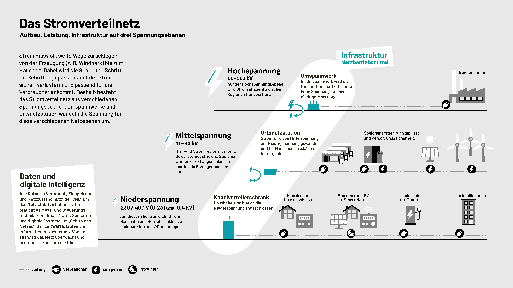

---

## Europäisches Verbundnetz

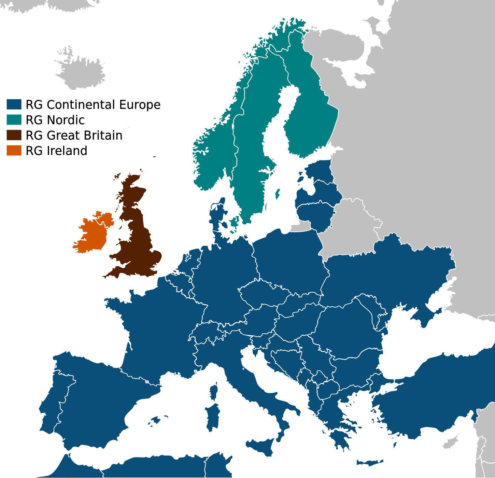{.r-stretch}

- größte Maschine der Welt
- Vorteile:
  - geringere Preise
  - größere Systemstabilität 

--- 

:::: {.columns .columns-vcenter}

::: {.column width="50%"}
- Übertragungsnetzbetreiber (ÜNB) [@smard_uebertragungsnetzbetreiber], betreiben Hochspannung:
  - Tennet
  - Amprion
  - TransnetBW
  - 50 Hertz 
- ["Wächter der Netzstabilität"](https://www.alamy.de/lehrte-deutschland-august-2023-ein-mitarbeiter-des-stromubertragungsnetzbetreibers-tennet-steht-und-sitzt-vor-mehreren-monitoren-im-schaltschrank-am-standort-lehrte-des-unternehmens-quelle-michael-mattheydpaalamy-live-news-image562205527.html)

:::

::: {.column width="50%" .figure-vcenter}
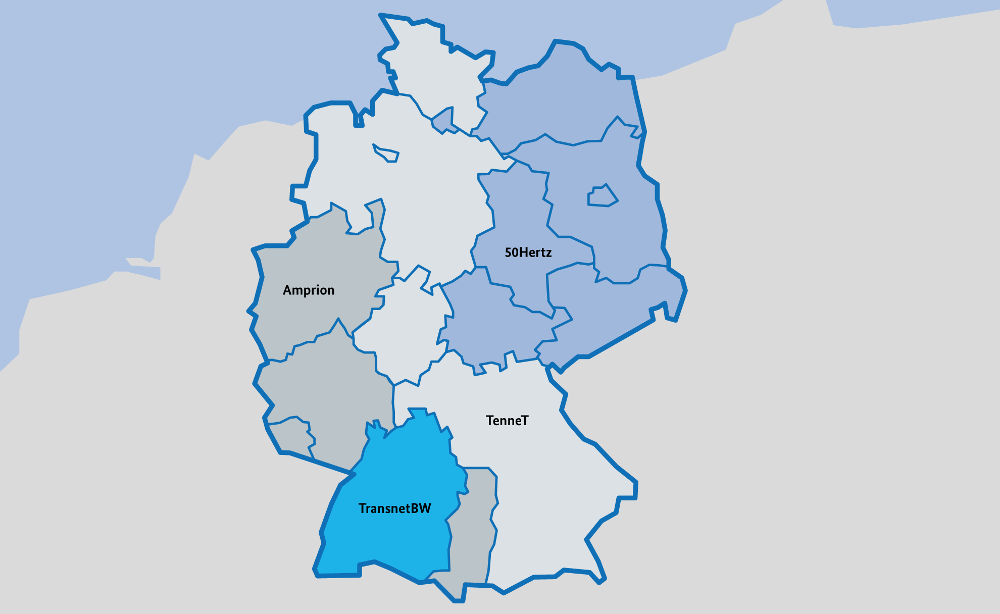
:::

::::

## Verteilnetzbetreiber (VNB) 
- Verteilnetzbetreiber: 851 Unternehmen @stratmann_stromnetzbetreiber_2026
  - Kritik: kleinteilige Struktur kann ineffizient sein
  - Gegenargument: lokale Nähe und kommunale Verankerung
  - mögliche Antwort: Kooperationen und gemeinsame Plattformen
- [Paragraf §14a EnWG](https://www.netze-bw.de/neuregelung-14a-enwg) - Auswirkungen auf Verbraucher
  - Schutz des Verteilnetzes vor Überlastung
  - Möglichkeit zum "Dimmen" in begrenzten Zeiträumen
  - Im Gegenzug Reduktion der Netzentgelte
  - Pflicht zum Netzausbau in betroffenen Gebiete

## Charakteristika des Strommarktes
- Markt **ohne** Möglichkeit zur Lagerhaltung
  - Bedingung: Erzeugung = Verbrauch
  - Abweichung: Veränderung der Netzfrequenz von 50Hz
- Verbrauch ist netzgebunden - Monopol des Stromnetzbetreibers
- keine eindeutige Zuordnung von Verbraucher zu Erzeuger
- Strom ist (zumeist) **Kuppelprodukt**:
  - elektrische Energie + jederzeitige Verfügbarkeit der Energie

## typischer Lastgang Deutschland

 @energy_charts_deutschland](assets/energy-charts_Prognosen_und_Ist-Wert_in_Deutschland_in_Woche_16_2026.svg){.r-stretch}

::: {.column width="50%"}
- Last in der Nacht niedrig
- steigt bis zum Mittag an
- Abflachen zum Nachmittag
:::

::: {.column width="50%"}
- Anstieg zum Abend 
- niedriger am Wochenende
- zw. 40-70 GW
:::

## Strompreis- und Erneuerbare Energien

Börsenstrompreis (Day-Ahead) als Indikator für Knappheit oder Überfluss von Strom

---

### Winter

 Day-Ahead Börsenstrompreise über eine Woche im Winter @energy_charts_deutschland](assets/energy_charts_strompreis_winter.svg)

::: {.column width="50%"}
- + ca. 160€/MWh Steuern, Netzentgelte und Umlagen
- Preispeaks abends und morgens
- am Wochenende günstigere Preise 
:::

::: {.column width="50%"}
- nachts günstigster Strom verfügbar
- Flaute & Sturm bestimmen Preisniveau des Tages
:::

---

### Sommer

 Day-Ahead Börsenstrompreise über eine Woche im Sommer @energy_charts_deutschland](assets/energy_charts_strompreis_sommer.svg)

::: {.column width="50%"}
- plus ca. 160€/MWh Steuern, Netzentgelte und Umlagen
- Solarstromspitzen sorgen verlässlich für Minimum zur Mittagszeit
- ausgeprägterer Peak abends, da rasches Absinken der PV-Erzeugung
:::

::: {.column width="50%"}
- PV-Überschüsse führen regelmäßig an Wochenende zu Null- oder Negativpreisen
- Feiertage / lange Wochenenden stellen zunehmend Problem dar
  - Gründe: starre EEG-Vergütung, geringe Flexibilisierung, fehlende Speicher
:::

---

## Strommarkt nach Liberalisierung
- Entflechtung von Erzeugung und Verteilung
- Strom handelbar über:
  - Termingeschäfte, Power-Purchase Agreements (PPA) (langfristig, z.B. Jahre im Vorraus) @next_kraftwerke_ppa
  - Day-Ahead-Markt(in 15min Stücken, Gebotabgabe bis 12 Uhr am Vortag)
  - Intraday-Markt (in 15min Stücken, bis 30/5min vor Lieferung)
- basierend auf Last- und Erzeugungsprognose (Wettervorhersage)

## Ablauf des Day-Ahead Markt
:::{.column width="40%"}

- Angebot nach variablen Grenzkosten
- letztes eingesetztes Kraftwerk bestimmt Preis
- Erneuerbare mit Grenzkosten 0€ drücken den Preis
- Aber: EEG garantiert bestimmte Vergütung und tw. (private PV) Einspeisung $\rightarrow$ negative Preise
- Solarspitzengesetz für privat-PV: keine Vergütung bei negativen Preisen, Begrenzung auf 70% der Maximalleistung $\rightarrow$ Speicher netzdienlich laden

:::

:::{.column width="60%"}

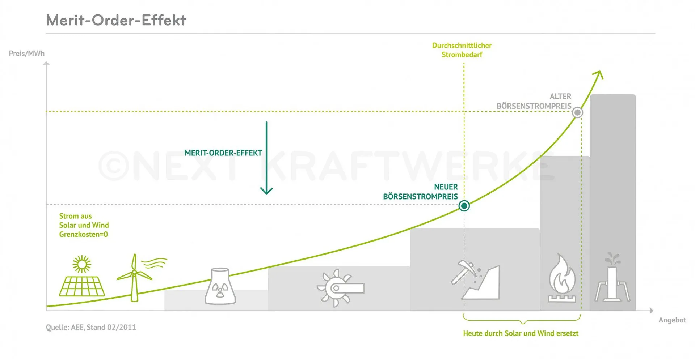

:::
  
## Redispatch

:::: {.columns}

::: {.column width="50%"}
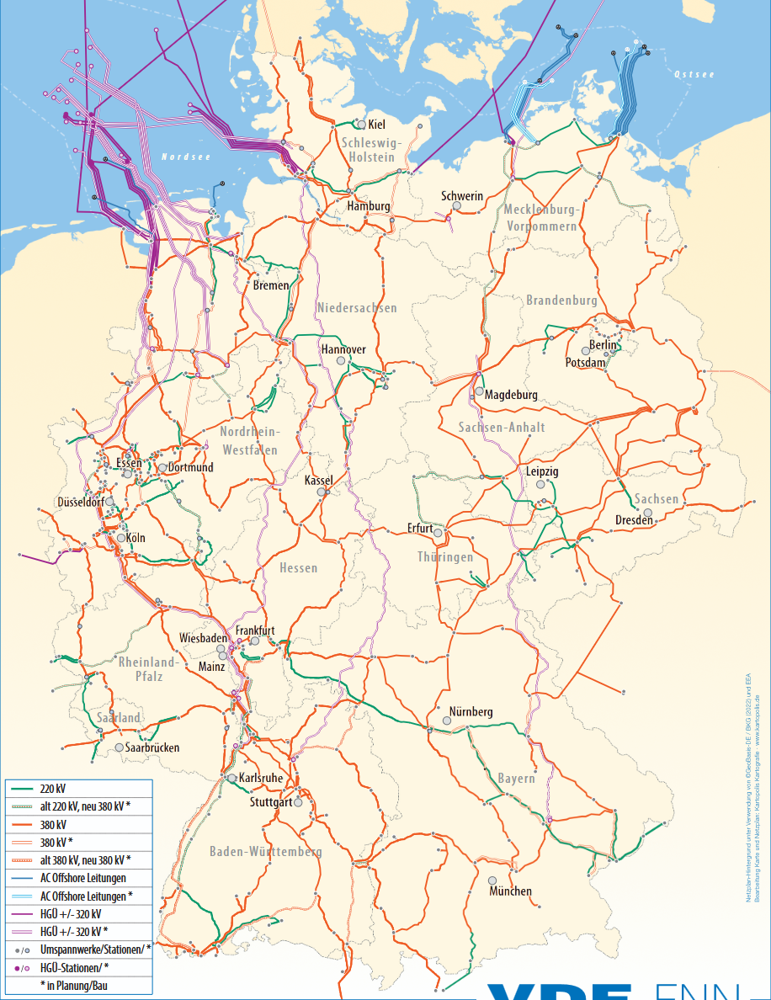{width="40%"}
:::

::: {.column width="50%"}

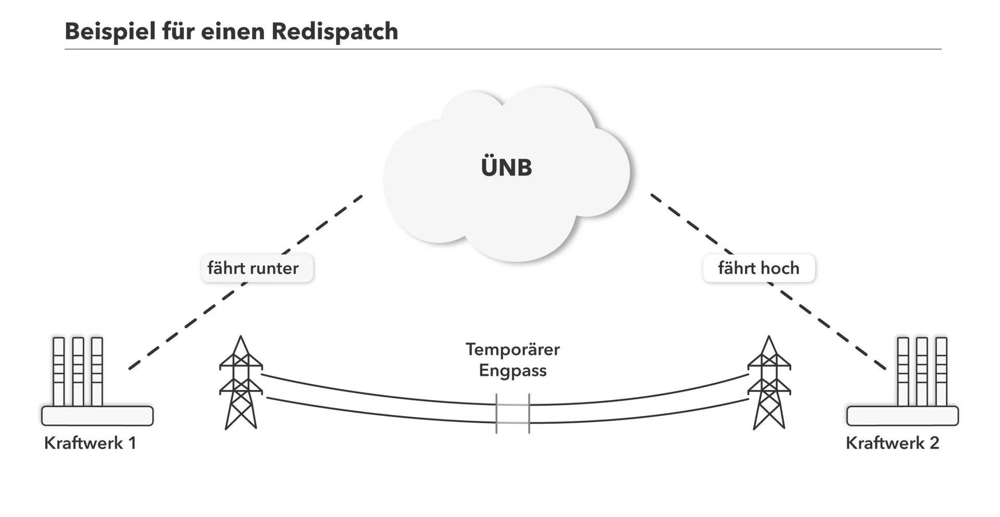
:::

:::: 

- Stromhandel: Deutschland = eine Preiszone
- Vernachlässigung der Übertragungskapazitäten ("Kupferplatte")
- Ausgleich identifizierter Engpässe durch ÜNB
- Kosten werden auf Netzentgelte umgelegt (steigend, 2024: ca 1.8 Mrd. €)^[zum Vergleich: ca. 50 Mrd. € Gesamtvolumen Börsenstromhandel (eigene Hochrechnung basierend auf @monitoringbericht_energie_2025) ] @monitoringbericht_energie_2025

---

- Gegenmaßnahmen:
  - Netzausbau Nord-Süd
  - Teilung von des deutschen Strommarktes in mehrere Preiszonen, die Übertragungskapazitäten berücksichtigen
    - Druck aus EU 
    <!-- - TODO: Quelle -->
    - Tendenziell geringer Strompreise im Norden, höhere im Süden 
    <!-- - TODO: Quelle -->
    - Befürchtung: Verlagerung von energieintensiver Industrie in den Norden
    - Preisunterschiede aber wahrscheinlich gering 
    <!-- - TODO: Quelle -->

# Energiesystem der Zukunft

- dezentralisierte Erzeugung
- digitalisierte und marktwirtschaftliche Kopplung von Erzeugung und Verbrauch
- Flexibilisierung von Verbrauch, insbesondere durch Sektorenkopplung
- Kurzzeitspeicher: Batterien, Wärmespeicher
- Langzeitspeicher: Wasserstoff ("Kalt-Dunkel-Flaute")

# Energiewende Zuhause
<!-- - überschlägige Rechnung der Ökonomie
- Lebensdauer
- zu beachten
- Flexibilisierung
- Blick in die Zukunft -->
  
## Smart-Meter
:::: {.columns}

::: {.column width="50%"}
- Smart-Meter nötig für dynamische Stromtarife
- stockender Smart-Meter Rollout
  - Deutschland 5.5% @bnetza_imsys_rollout_q42025
  - Europa 63% Quote, Skandinavien, Frankeich, Spanien > 90% @bakkenbuell_smart_meter_2025
  - "500 der ca. 900 VNB hätten keine Smart-Meter installiert" @bakkenbuell_smart_meter_2025
:::

::: {.column width="50%"}
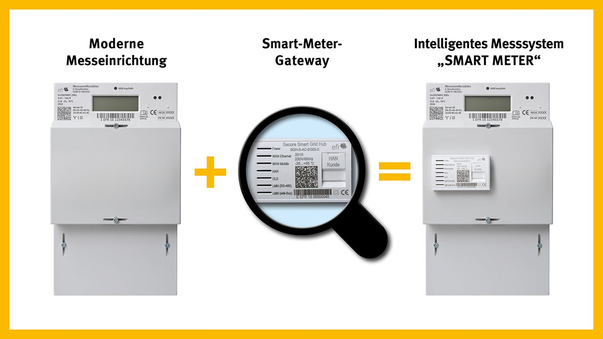
:::

::::
  - Gründe:
    - politisch bewusst verschleppter Rollout, Vorwand Datenschutzbedenken
    - Ineffizienzen bei kleinen VNB

---

## CO2 Emmissionen / Strompreis überprüfen

und Verbrauch großer Geräte (Geschirrspüler, Waschmaschine, Trockner, E-Auto, Wärmepumpe) anpassen

- [smard.de](https://www.smard.de/) (Strommarkttransparenzstelle)
- [energy-charts.info](https://www.energy-charts.info/charts/consumption_advice/chart.htm?l=de&c=DE) (Fraunhofer ISE), [Stromampel-App](https://www.energy-charts.info/downloads.html?l=de&c=DE)
- [Electricity Maps](https://app.electricitymaps.com/map/zone/DE/live/fifteen_minutes) (App zu weltweiter Emissionsintensität)

## dynamische Stromtarife

von wechselnden Strompreisen profitieren

- macht vor allem Sinn, wenn große verschiebbare Lasten vorhanden (E-Auto, Wärmepumpe, Batteriespeicher)
- Verpflichtung, dynamische Stromtarife (Day-Ahead-Preis) anzubieten
- andere Tarifmodelle denkbar:
  -  Tarife mit mehreren Preiszonen pro Tag
  -  Tarife mit aktiver Ansteuerung des Ladevorganges bei E-Auto
  -  noch wenig Anbieter (bisher Octopus Energy)
  
## PV & Speicher

- Kosten: ca. 15.000€ für 10kWp PV-Anlage, 10kWh Speicher & Elektroinstallation
- pro kWp: ca. 1000 kWh Strom pro Jahr
- Speicher nicht zu groß wählen, wichtig für Eigenverbrauch. [Einfache Web-Tools hier](https://solar.htw-berlin.de/rechner/), [einfache Faustformeln hier](https://solar.htw-berlin.de/publikationen/auslegung-von-solarstromspeichern/)
- Reduktion des Strombezuges um 80%, geringe Vergütung von 0.07/€ kWh für eingespeisten Strom
- sehr attraktiv in Kombination mit E-Auto oder Wärmepumpe: PV-Überschussladen

---

### Netzdienlichkeit von privaten PV Anlagen

- aufgrund fester EEG Vergütung fixe Einspeisung
- -499.99€/MWh Börsenstrompreis am 1.Mai 2026
  - $\rightarrow$ hier wird sich etwas ändern müssen
- heutige mögliche Lösungen
  - mindestens: [prognosebasierte Ladung](https://solar.htw-berlin.de/themen/prognosebasierte-batterieladung/) 
  - oder Integration in ein virtuelles Kraftwerk, z.B. bei Anbietern wie 1KOMMA5, attraktive Vergütung $\rightarrow$ **zukünftig sinnvollstes Modell**
  - **Wichtig**: Orchestrierung & Kommunikation der Komponenten, des (dynamischen) Stromtarifes und Prognosen, viele einfache Anbieter bieten hier wenig.
    - zum Selbermachen: z.B. clever-pv, EVCC... (IT-Affinität nötig)
- Zukünftig:
  - Bereitstellung von Systemdienstleistungen (Regelenergie, lokale Spannungshaltung)
  - Diskussion: indirekten Subventionierung durch Einsparung von Netzentgelten bei nur tw. reduzierter Infrastrukturnutzung (Sozialaspekt)

## Alternative: Balkonkraftwerke

- steckerfertige Solaranlagen zur Selbstmontage, 4kWp PV, 4kWh Speicher für 2000€
- Speicher können auch mit dynamischen Stromtarifen arbeiten (Winter)
- max. 800W Einspeisung, begrenzter Nutzen für E-Autos und Wärmepumpen
- Interessante Anbieter: 
  - Solakon (deutsche Server)
  - Ecoflow (flexibel platzierbar Speichermodule mit 1200W Steckdose)

## Wärmepumpe

- Wärmepumpen funktionieren in fast allen Bestandsgebäuden^[[Wärmepumpen im Bestand, Blog-Serie](https://blog.innovation4e.de/2021/02/10/waermepumpen-im-bestand-eine-serie-in-12-folgen/)]
- bei anstehendem Austausch über Laufzeit günstiger als Gasheizung
  - Beispiel: 20.000kWh Wärmebedarf, konservative Annahmen^[Gasheizung: 0,10€/kWh Gas, 12.000€ Investition, 100€ Schornsteinfeger/Jahr, Wirkungsgrad 90%]^[Wärmepumpe: 0,30€/kWh Strom, 15.000€ Investition (50% Förderung), COP 4]:
    - über 15 Jahre: 
      - Gasheizung: **46.300€**^[12.000€ + (20.000kWh / 0.9 * 0,10€/kWh + 100€) * 15 Jahre = 46.300€]
      - Wärmepumpe: **37.500€**^[15.000€ + (20.000kWh **/ 4** * 0,30€/kWh) * 15 = 37.500€]
    - perspektiv Strom gleich teuer oder günstiger (dynamische Tarif, Solaranlage)
    - perspektivisch Gas teurer (CO2-Preis, steigende Netzentgelte, "Biotreppe")
- bei vorzeitigem Austausch oft auch günstiger, v.a. bei älteren Heizungen (Wirkungsgrad) oder dynamische Tarife / PV

---

- mein Tipp: erfahrener Betrieb & besonders effiziente Geräte (z.B. Lambda, Heliotherm)^[weitere Informationsquellen: [JAZ-Rechner](https://www.waermepumpe.de/werkzeuge/jaz-rechner/), [YouTube Kanal Henrich Schröder (Gütersloh)](https://www.youtube.com/@henrichschroeder), [YouTube Video: 250 Lambda Wärmepumpen im Bestand](https://www.youtube.com/watch?v=Y2QwiyKPjH4)]

---

### Alternative: Klima-Splitgeräte

- gleich Funktionsweise und Wirkungsgrad wie Wärmepumpe
- Nachteil: Luftzug, ungleichmäßige Wärmeverteilung
- günstige Lösung, Einzelgeräte ab 1000€ bzw. 3500€ mit Einbau
- mögliche Low-Budget-Lösung und Zusatznutzen im Sommer (Schutz vor Hitzewellen)

## E-Auto

- direkte Emissionen (aktuell): 150-200g $\text{CO}_2$/km Verbrenner vs. 60g $\text{CO}_2$/km ^[eigene Rechnung, Annahmen: 20kWh/100km, 300g $\text{CO}_2$ / kWh Strom] 60g $\text{CO}_2$ / km E-Auto
  - "Emissionsrucksack" von 20-70kg $\text{CO}_2$/kWH Batterie (je nach Herstellungsregion, Zahlen für 2030 @green_ncap_lca_methodology_2022)
- Lebenszyklus-Emissionen deutlich geringer als von Verbrennern, [ADAC-Tool](https://www.greenncap.com/lca-german.php)^[ [ADAC-Artikel zu Lebenszyklus-Emissionen](https://www.adac.de/verkehr/tanken-kraftstoff-antrieb/alternative-antriebe/klimabilanz/#neu-die-interaktive-lca-plattform) ]
  - 50.1t (Diesel) vs. 27.6t (E-Auto) vs. 14.9t (E-Auto nur Windstrom) @kroher_treibhausgas_bilanz_2022
  - weiteres Absinken (effizientere Produktion, fortschreitende Emissionsreduktion des Fahrstroms)
- Klimanutzen bei Ersatz von Bestandsfahrzeugen ab ca. 7500km/Jahr @bianchetti_kaufentscheid_elektroauto

---

### E-Auto: Batterien

:::{.column width="50%"}
- Lebensdauer unproblematisch
  - Wichtig: dauerhafte Ladestände > 80% und < 20% vermeiden
- Rohstoff-Thematik entschärft sich in Zukunft:
  - neue Technologien (Lithium-Eisen-Phosphat (LFP), Natrium-Ionen-Batterien)
  - Recycling
  - meines Erachtens: geringere Umwelt- und soziale Auswirkungen als fossile Brennstoffe
- weniger Wartungskosten, geringere Betriebskosten

:::

:::{.column width="50%"}

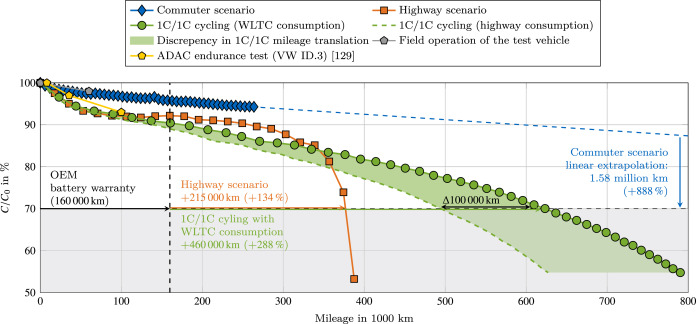

- bei Kauf eines E-Autos Batteriezertifikat (z.B. von [aviloo](https://aviloo.com/de/)) anfordern

:::

# Quellen {.smaller}

::: {#refs}
:::

# Backup-Folien

## Exkurs: Wandelbarkeit von Energie

- Wirkungsgrad: $\eta=\frac{Nutzen}{Aufwand}$
- Thermodynamik, N.Carnot (1824): Wärme ist nicht uneingeschränkt in Arbeit wandelbar
- Arbeit dahingegen vollständig in Wärme wandelbar
- Beispiele
  - Wasserkocher: Strom (Arbeit) $\rightarrow$ Wärme: 100% Wirkungsgrad
  - Auto mit Verbrennungsmotor: chemische Energie in Form von Wärme $\rightarrow$ Antrieb: ~30-40% Wirkungsgrad
- je höher die Temperatur der Wärme, desto wertvoller (mehr Arbeit erzeugbar, Carnot-Faktor)

## Klassiker: Kombi-Kraftwerke
- Grundlagen: 
  - Wärme nie uneingeschränkt in Arbeit wandelbar
  - Arbeit dahingegen immer vollständig in Wärme wandelbar
  - Wärme stellt (je nach Temperatur) niedrigst-wertvollste Energieform dar
- Kraftwerke mit Wärmeauskopplung (Fernwärme)
  - Gas-und-Dampfkraftwerk (GuD) bis ca. 65% Wirkungsgrad [@siemens_energy_combined_cycle]
  - Blockheizkraftwerke (BHKW) bis ca. 50% Wirkungsgrad [@innio_jenbacher_j920_flextra]
  - mit Wärmenutzung (Fernwärmenetz) bis 90% Nutzungsgrad
  - strombasierte oder wärmebasierte Steuerung
  - Flexibilisierung durch Wärmespeicher
- neue Motoren und Turbinen prinzipiell mit Wasserstoff möglich
  - 20 Vol-% Wasserstoff sind nur x% CO2-Reduktion, da $\text{H}_2$ nur x/x der Energiedichte von Erdgas hat
  - $\rightarrow$ nur 100% Wasserstoff ist klimaneutral!

## Leistung und Energie

- Leistung und Energie ist etwas unterschiedliches!
- **Energie**: Arbeit, die verrichtet wurde [in W oder kW]
- **Leistung**: Geschwindigkeit der Arbeitsverrichtung [in Wh, kWh, MWh]

- am gebräuchlichsten: kWh - **k**ilo**w**att**h**our (Kilowattstunde)
- Zusammenhang: $E = \int P(t) dt$

- Rechenbeispiele
  - 1h E-Auto laden mit 11kW
    - $11 \text{kW} \cdot 1\text{h} = 11 \text{kWh}$
  - 5min Wasserkocher mit 2000W
    - $2000 \text{W} \cdot 5/60\text{h} = 166 \text{Wh} = 0.166 \text{kWh}$
- Strompreis privat: ca. 0.3€/kWh

---

- ÜNB als Wächter der Netzstabilität
  - Bilanzkreis: virtuelles Energiemengenkonto eines Energiehändlers @next_kraftwerke_bilanzkreis
    - Einspeisung
    - Entnahme
  - Bilanzkreisverantwortliche reichen Fahrplan einen Tag vorher ein
  - ÜNB überprüfen Fahrplan 
  - Basierend auf Fahrplänen: Lastflussrechnungen identifizieren Engpässe
  - Unstimmigkeiten: werden von ÜNB durch (teuere) Ausgleichsenergie behoben

---

 @bdew_nutzenergiebilanz_2025](assets/1_Energieflussbild_Deutschland_2023_TWh_detailliert.svg)

---

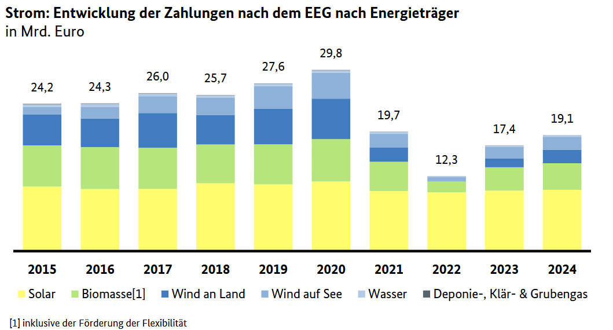{.r-stretch}

---

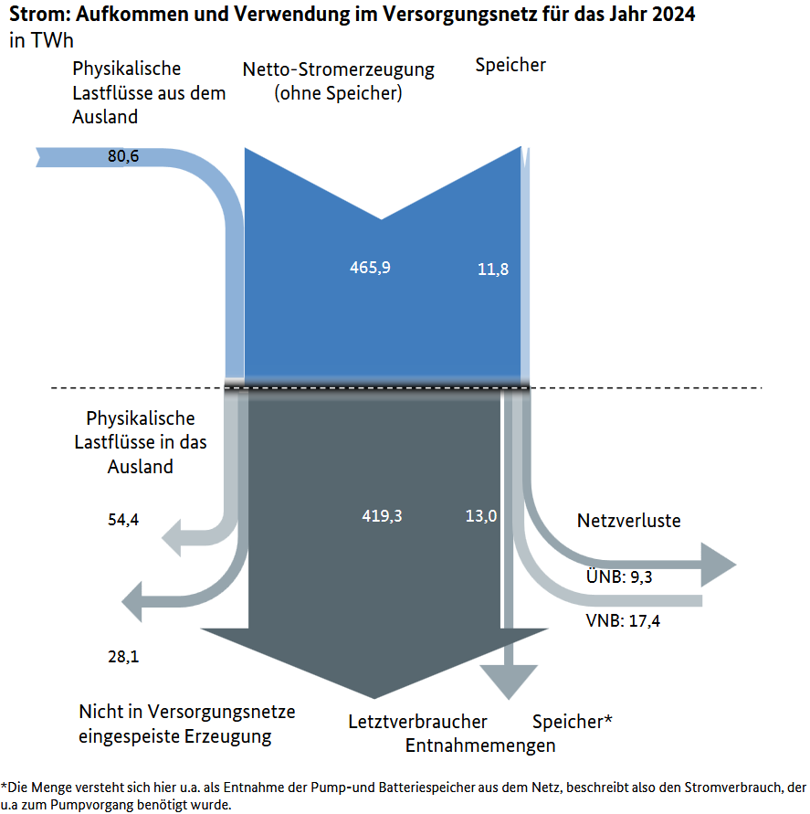{.r-stretch}

---

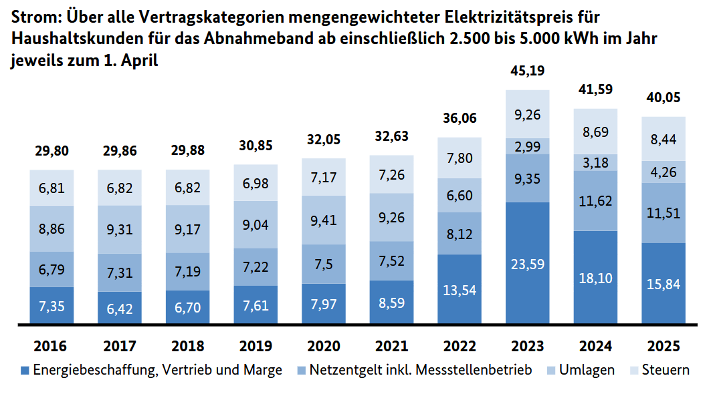{.r-stretch}

---

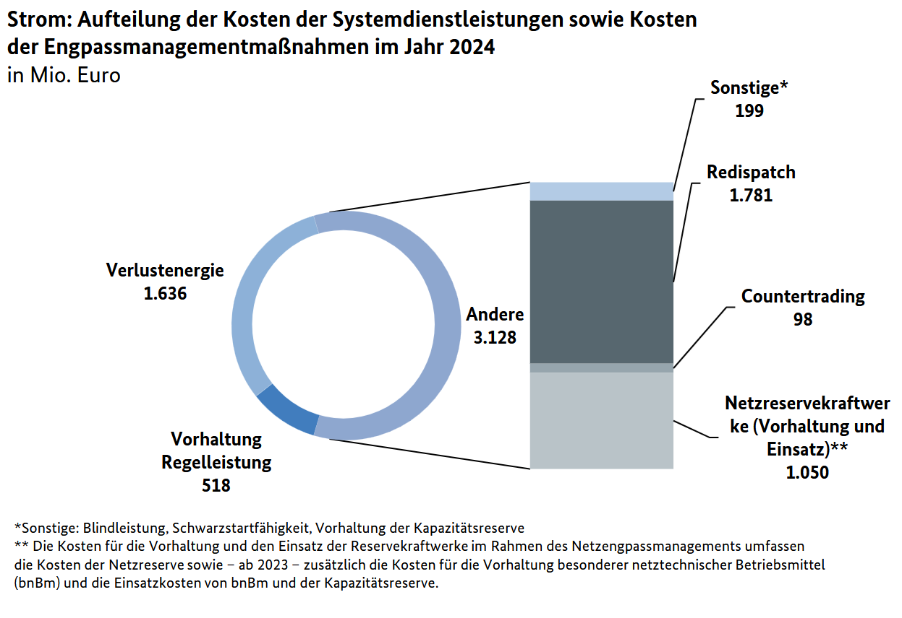{.r-stretch}

---

Das "Atomenergie-Paradox"

<iframe src="https://www.linkedin.com/embed/feed/update/urn:li:share:7445361824750850049?collapsed=1" height="513" width="504" frameborder="0" allowfullscreen="" title="Eingebetteter Beitrag"></iframe>

---

Energieeffizienz bewirkt größere Fortschritte als man denkt

<iframe src="https://www.linkedin.com/embed/feed/update/urn:li:share:7261647198113644544?collapsed=1" height="672" width="504" frameborder="0" allowfullscreen="" title="Eingebetteter Beitrag"></iframe>